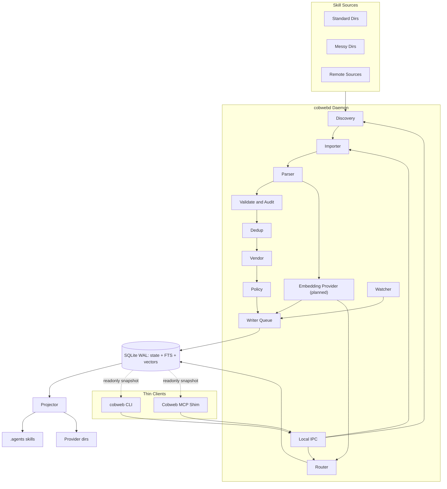

# Cobweb 架构与总体设计

> 命名说明：项目正式名为 **Cobweb**（蛛网）。这个隐喻贴合产品内核——把散落各处的 skill 连成一张可治理、可检索、可路由的“技能蛛网”（内部仍以 SkillGraph 指代该图模型）。
>
> 命名体系：产品 `Cobweb`｜CLI `cobweb`（短别名 `cw`）｜daemon `cobwebd`｜MCP 服务 `Cobweb MCP`（内部路由引擎 Router）｜配置 `cobweb.config.yaml`｜锁文件 `cobweb.lock.yaml`｜本地库 `cobweb.db`。

## 0. 定位与结论

**Cobweb** 是一个本地优先的 Agent Skill 管理与路由系统。它不发明新的 skill 格式，也不替代 Cursor、Claude Code、Codex 等工具的原生 skill 机制，而是在开放 `SKILL.md` 标准之上提供统一治理、索引、审计、去重、跨工具投射和运行时路由。

推荐总体架构：**按需常驻 daemon + 瘦客户端 + SQLite(WAL) 单写者**。

- `cobwebd` daemon 承载重状态：SQLite 写句柄、索引、文件监听、增量任务、（规划中的）embedding 模型。
- `cobweb` CLI 是用户操作入口，所有写入优先通过 daemon 的 Writer Queue。
- `Cobweb MCP` 是 stdio shim，只转发请求，不加载索引、不启动 watcher、不直接写库。
- SQLite 是可重建状态库；磁盘上的 skill 文件与 `cobweb.lock.yaml` 才是真源。
- daemon 不开机自启、不永久占内存；由 CLI/MCP 惰性拉起，短期保温，空闲自退。

## 1. 背景

Agent Skills 生态已经收敛到以 `SKILL.md` 为核心的开放目录结构。`SKILL.md` 通常包含 `name`、`description` 和执行说明，并可附带 `references/`、`scripts/`、`assets/` 等资源。多数 Agent 工具已经支持相近的三层渐进披露模型：

1. 启动时只加载 `name` 与 `description`。
2. 命中 skill 后读取完整 `SKILL.md`。
3. 需要时再读取外部资源或脚本。

格式统一后，真正的问题从“适配不同格式”转移到“治理与选择”：

- skill 分散在 `.agents/skills/`、`.cursor/skills/`、`.claude/skills/`、`.codex/skills/`、全局目录、项目目录和历史工作区。
- 同名、近重复、失效引用、越界依赖、策略漂移会造成误选和不可移植。
- 原生 Agent 通常只靠 `name + description` 让模型自行选择 skill，缺少可解释排序、路径过滤和创建前查重。
- 市面开源项目大多偏安装、目录、市场或远端 registry，较少解决用户本机已有 skill 的持续治理。

## 2. 市场可借鉴优点与吸收情况

下表逐项列出对标项目的可借鉴优点，以及 Cobweb 是否吸收、落在哪一阶段。

| 对标项目 | 可借鉴优点 | Cobweb 吸收情况 | 落点 |
| --- | --- | --- | --- |
| `agentskills/agentskills` | 开放 `SKILL.md` 规范、三层渐进披露 | 吸收：严格兼容规范，不做私有格式；增强字段进 sidecar/索引 | 阶段一 |
| `vercel-labs/skills`、`skills.sh` | 低门槛 CLI、目录/排行榜发现、安装量与来源信誉 | 吸收：CLI 体验；来源信誉/安装量并入 `trust_level` 评分 | 阶段一/四 |
| `gh skill` | 把 provenance（repo/ref/tree SHA）**写进 `SKILL.md` frontmatter**，复制后仍可追溯；发布前 spec 校验 | 吸收：可移植 provenance + 发布前校验 | 阶段一 |
| `luongnv89/asm` | provider 抽象、TUI、**共享 lockfile 让多工具互相识别** | 吸收：provider 抽象（阶段一）、lockfile 互操作（阶段一）、TUI（阶段四） | 阶段一/四 |
| `skills-mcp` | MCP 运行时按需加载、最小上下文、三层资源工具、语义搜索 | 吸收：最小上下文路由（阶段二）、语义召回（阶段三 embedding） | 阶段二/三 |
| `agentregistry` | skill 纳入“Agent 依赖图”（agent/MCP/prompt 关系）、版本化 | 部分吸收：图模型预留 `Agent/Tool/MCP` 节点关系；团队化后做 | 阶段四 |
| `mcp-gateway-registry` | 安全扫描（YARA + 静态 + LLM）、健康检查、可见性/权限、审计日志 | 吸收：audit 复用成熟扫描规则、外链可达性检查、`visibility/trust/risk` 字段 | 阶段一（基础）/四（权限） |
| Trail of Bits skills / curated | 承认 skill 可能含恶意 hook/后门，需质量门槛与人工精选 | 吸收：audit 一等公民、`trust_level` 分级、安装前审计 | 阶段一 |
| `ComposioHQ/awesome-claude-skills` | 分类/标签/用例利于发现；awesome list 可作候选源 | 吸收：发现源插件化，候选先审计去重再落地 | 阶段四 |

尚未在旧版充分体现、本版补强的三处：

1. **可移植 provenance**：借鉴 `gh skill`，把来源信息写进 frontmatter，复制/迁移后仍可追溯（不只存在本地 DB）。
2. **lockfile 互操作**：借鉴 `asm`，`cobweb.lock.yaml` 之外兼容读取主流共享 lockfile，避免与其它工具互相“看不见”对方的安装。
3. **复用成熟安全扫描**：借鉴 `mcp-gateway-registry`，audit 优先复用现成 YARA/扫描规则，而非全部自研。

## 3. 差异化定位

- **本地 SkillGraph（蛛网）**：统一建图本机、项目、团队仓库和历史目录中的 skill。
- **治理优先**：导入、去重、修复、审计、策略对账、漂移检测。
- **路由优先**：让 Agent 在执行前选中最高匹配的已有 skill，并在创建新 skill 前查重。
- **自包含化修复**：检测并修复 `SKILL.md` 引用目录外文件导致的不可移植问题。
- **语义增强（规划）**：embedding 让去重、查重、重叠检测与自然语言路由质量显著提升。
- **本地优先，团队可扩展**：先用 SQLite 单机稳定运行，后续再接团队 registry。

## 4. 产品边界

必须守住的边界：

- 不发明新的 skill 格式，兼容开放 `SKILL.md`。
- 不覆盖用户显式 `/skill`、`$skill` 或手动选择。
- 不把所有 skill 全文塞给 Agent。
- 不让向量相似度成为唯一裁判（embedding 只做召回与提示，不做最终拍板）。
- 不静默执行高风险脚本或高风险 skill。
- 不要求用户把历史 skill 改写成 Cobweb 私有协议。

## 5. 总体架构

图例：

- `cobwebd Daemon` 是本地单实例、按需常驻进程。
- `cobweb CLI` 是用户入口。
- `Cobweb MCP Shim` 是 Agent 入口，每个会话可启动一个，但只转发请求。
- `SQLite WAL` 同库承载结构化状态、FTS5 检索与（阶段三）向量表。
- `Embedding Provider` 为规划模块，阶段一/二只预留接口与表结构，不实现。
- daemon 不可用时，CLI/MCP 可只读打开 SQLite 最近快照。

## 6. daemon 生命周期

`cobwebd` 不做开机自启、永久驻留后台服务，而采用 **按需启动 + 短期保温 + 空闲自退**：

- 启动触发：`cobweb` CLI 写命令、Agent 调用 MCP 工具、或用户显式运行 `cobweb daemon start`。
- 保温窗口：最近一次请求后继续存活 5-15 分钟，复用 SQLite 连接、watcher、索引与（启用后的）embedding 模型。
- 空闲退出：没有请求、后台任务、待处理 watcher 事件时自动退出，释放运行内存。
- 资源上限：embedding 默认关闭；开启后只在 daemon 中加载一份，并可随 idle 卸载模型权重。
- 降级路径：daemon 不在时，只读命令可读取 SQLite 快照；写命令必须拉起 daemon。

MCP 使用方式：

- 配置 MCP 后，客户端会启动 stdio shim，不需要用户每次输入 `/cobweb` 才启动服务。
- Agent 是否自动调用取决于触发策略。推荐提供 always-on 规则或 `AGENTS.md` 约定“任务开始前调用 `skill_select`”，同时提供可显式调用的 `cobweb` meta-skill（用户可用 `/cobweb` 或自然语言显式触发）。

## 7. 核心模块

### 7.1 Discovery / Importer

- 扫描标准目录：`.agents/skills/`、`.cursor/skills/`、`.claude/skills/`、`.codex/skills/`。
- 扫描用户登记的历史目录和任意混乱目录。
- 识别包含 `SKILL.md` 的目录、疑似 skill 的 Markdown 工作流文档、多 skill 仓库布局。
- 生成 dry-run 导入计划，列出候选、来源、风险、重复项和建议动作。

### 7.2 Parser / Canonical Store

- 解析 frontmatter、正文 heading、资源引用、脚本引用和 sidecar policy。
- 保留标准字段和未知扩展字段。
- 生成 canonical source 与 `cobweb.lock.yaml`；并把可移植 provenance 写回 frontmatter。
- 确保 SQLite 只是缓存，真实 skill 文件和 lockfile 可重建数据库。

### 7.3 Validate / Audit

- 校验 `name`、`description`、正文长度、资源存在性、路径作用域。
- 检查 scripts、hooks、外链、危险命令、凭据访问、绝对路径、越界引用。
- 优先复用成熟扫描规则（YARA/静态规则），降低自研误报。
- 可选检查外链/外部资源可达性（liveness）。
- 记录 `trust_level`、`risk_level`、`audit_result`。
- 高风险 skill 默认不进入自动路由候选。

### 7.4 Dedup / Vendor / Policy

- 检测同名、近重复、内容 hash 重复（阶段三引入语义近重复）。
- 对越界引用生成 vendor 修复计划，将外部引用复制进 skill 内部并重写路径。
- 对齐跨工具调用策略，例如 Cursor frontmatter 与 Codex sidecar 的隐式调用策略。

### 7.5 Projector / Provider

- 将 canonical source 投射到 `.agents/skills/` 主落点。
- 对旧工具或特殊工具投射到 provider 兼容目录。
- 支持 link/copy/manifest 策略。
- sync 使用临时路径写入、原子替换、写后校验，失败时标记漂移。

### 7.6 Router

- 对用户任务、当前路径、当前文件、显式 skill 选择进行混合召回排序。
- 召回信号：路径过滤、策略过滤、BM25/FTS（词面）、规则触发、（阶段三）向量语义召回。
- 融合后再做硬过滤与降权：重复降权、安全降权、禁用过滤。
- 返回推荐 skill/method、置信度、理由、不推荐原因、freshness。
- 创建新 skill 前查重，避免近重复累积。

### 7.7 Embedding Provider（规划，阶段三实现）

定位：embedding 不是锦上添花，而是显著提升“管理质量”的关键能力——它让**语义近重复检测、创建前查重、跨 skill 重叠/可替代识别、自然语言任务路由**都明显变准。本版在架构层先把接口与存储 seam 预留好，阶段一/二不实现但不堵死。

- 接口：`EmbeddingProvider { embed(texts): Vector[] }`，可切换本地或外部实现。
- 模型：默认本地（`transformers.js` / `fastembed`/ONNX 量化模型），可选外部 API；本地优先保隐私。
- 嵌入对象：先嵌入 `name + description + method summary`（L1/L2 语义），不默认嵌入大体积资源。
- 存储：阶段三在同一 SQLite 增加 `skill_vectors` 表；候选规模小（数十到数千），**可先用暴力余弦**（毫秒级），无需 ANN；如需扩展再引 `sqlite-vec`（vec0）。
- 增量：以 `content_hash` 为键增量嵌入，内容不变不重算。
- 生命周期：模型仅在 daemon 保温期间常驻一份，idle 卸载。
- 边界：向量只做召回与“可能重复/可能更优”提示，最终排序仍由规则 + 安全 + 去重 + 显式意图共同决定。
- 管理增益：`dedup`/`skill_validate` 接入语义相似度后，能发现“措辞不同但语义重复”的 skill，这是纯词面/hash 无法覆盖的。

## 8. 数据模型

核心对象：

- `Skill`：`id`、`name`、`description`、`root_path`、`canonical_path`、`detected_locations`、`paths`、`source_type`、`provenance`、`implicit_invocation`、`self_contained`、`trust_level`、`risk_level`、`content_hash`、`updated_at`。
- `Method`：`method_name`、`summary`、`trigger_terms`、`inputs`、`outputs`、`required_tools`、`source_section_range`、`extraction_confidence`。（Method 抽取自阶段二随 FTS 一起落地。）
- `Resource`：`resource_type`、`path`、`is_external`、`mentioned_by`、`risk_flags`、`hash`。
- `Provider`：`provider_name`、`global_paths`、`project_paths`、`supports_agents_dir`、`policy_mapping`、`projection_strategy`。
- `RuntimeState`：`repo_root`、`db_path`、`daemon_instance_id`、`freshness`、`last_scan_at`、`last_checkpoint_at`、`watch_roots`、`pending_changes`、`last_error`。
- `SkillVector`（阶段三）：`skill_id`、`model`、`dim`、`vector`、`embedded_content_hash`。

核心关系：

- `SKILL_HAS_METHOD`
- `METHOD_REFERENCES_RESOURCE`
- `SKILL_SCOPED_TO_PATH`
- `SKILL_INSTALLED_TO_PROVIDER`
- `SKILL_DUPLICATES_SKILL`
- `SKILL_OVERLAPS_SKILL`（阶段三语义重叠增强）
- `SKILL_CONFLICTS_WITH_SKILL`
- `SKILL_REQUIRES_TOOL`
- `SKILL_HAS_EXTERNAL_REF`
- `SKILL_IMPORTED_FROM_SOURCE`

## 9. 存储、并发与容错

SQLite 策略：

- 默认使用 `node:sqlite`，避免原生编译风险；`better-sqlite3` 仅作为可选高性能后端。
- 启动设置 `journal_mode=WAL`、`busy_timeout=5000`、`synchronous=NORMAL`、`foreign_keys=ON`。
- 所有写入经过 daemon 的 Writer Queue。
- 批量导入、审计、同步写入必须包在事务中。
- 定期 WAL checkpoint，避免 WAL 文件长期增长。
- SQLite 损坏时运行 `integrity_check`；失败则从 skill 文件和 lockfile 重建。

监听与新鲜度：

- daemon 只启动一套 watcher。
- watcher 事件 debounce 后进入 Writer Queue。
- watcher 失效或平台 watch 数量触顶时，降级为按需扫描并标记 `watch_degraded`。
- 大批量变化时后台重建，前台读旧快照并标记 `freshness: rebuilding`。

## 10. 技术选型

- 语言：TypeScript / Node.js
- CLI：`commander` 或 `clipanion`
- daemon：本地单实例 `cobwebd`，支持惰性自启、idle 退出、健康检查
- 本地 IPC：Unix domain socket 优先；Windows 或兼容场景使用 `127.0.0.1 + token`
- 文件扫描：`fast-glob` + `ignore`
- 文件监听：`chokidar`
- frontmatter：`gray-matter` + `yaml`
- Markdown AST：`unified` + `remark-parse`
- 本地状态库：`node:sqlite` + SQLite WAL
- 全文检索：SQLite FTS5
- 向量（阶段三）：暴力余弦起步，规模增大再引 `sqlite-vec`；embedding 用本地 ONNX 模型或外部 API
- MCP：`@modelcontextprotocol/sdk`，MCP 进程只做 stdio shim
- 日志：`pino`
- 测试：`vitest`
- 打包：评估 Node SEA 单可执行文件

## 11. 分阶段路线

### 阶段一：本地治理内核

- `cobwebd` daemon 骨架、IPC、Writer Queue、SQLite 状态库。
- `cobweb` CLI。
- 标准目录与任意目录扫描。
- `SKILL.md` 解析、frontmatter 校验、资源引用检测。
- canonical store、`cobweb.lock.yaml`、可移植 provenance、lockfile 互操作读取。
- provider 抽象与 `.agents/skills/` 投射。
- 同名/轻量近重复（hash + 词面）检测。
- 越界引用检测与 `vendor --dry-run`。
- `lint`、`audit`、`status`、`sync`、`policy check`。

### 阶段二：Cobweb MCP + FTS 路由

- SQLite FTS5 检索表与 Method 抽取。
- 单套 watcher 与增量索引。
- Cobweb MCP stdio shim。
- `skill_search`、`skill_select`、`skill_context`、`skill_validate`。
- 创建前查重（词面级）。
- 可解释路由结果。

### 阶段三：语义 / embedding 增强

- `EmbeddingProvider` 与 `skill_vectors` 表落地。
- 混合召回：FTS（词面）+ 向量（语义）+ 规则，用 RRF/加权融合，硬过滤与降权不变。
- 语义近重复并入 `dedup` 与 `skill_validate` 的创建前查重。
- 语义重叠/可替代关系增强（`SKILL_OVERLAPS_SKILL`）。
- 模型 daemon 常驻 + idle 卸载 + 按 `content_hash` 增量嵌入。

### 阶段四：生态与团队化

- skills.sh / GitHub / awesome list 外部发现源（候选先审计去重）。
- TUI。
- 团队 registry、可见性与权限、策略中心。
- Web UI。
- 反馈闭环和排序调优。

## 12. 成功指标

第一阶段：

- 能扫描并识别当前机器/项目中 90% 以上的标准 skill。
- 能指出重复 skill、同名冲突和越界引用。
- 能统一展示 Cursor、Claude、Codex 等 provider 的可见状态。
- 能把混乱目录中的 skill dry-run 导入为 canonical source。
- 能把 canonical source 投射到 `.agents/skills/`。
- daemon warm 状态下，本地 `status/scan/dedup` 查询 p95 < 20ms。
- daemon 崩溃后 CLI 可惰性重启；重启失败时只读快照查询仍可用。
- 并发 CLI/MCP 读写不出现未处理的 `SQLITE_BUSY`。

第二阶段：

- 常见任务 Top-1 推荐命中率超过原生 L1 选择。
- 仅显式调用 skill 的误推荐率为 0。
- 重复 skill 只推荐 canonical source。
- 创建新 skill 前能发现高相似已有项（词面级）。
- MCP stdio shim 冷启动不加载索引/模型，目标 < 50ms 可服务。

第三阶段：

- 语义近重复检出率显著高于纯词面/hash（用标注样本验证）。
- 自然语言任务的路由召回率较纯 FTS 提升，且误推荐不上升。
- 嵌入增量更新：内容不变不重算；模型 idle 后内存回落。
